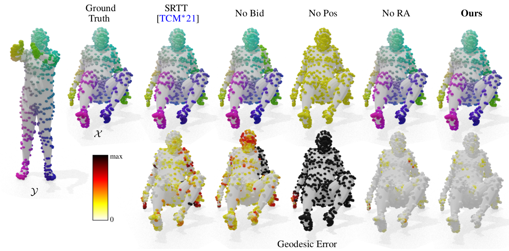

# SGP23_AttPos4ShapeMatching

Paper at https://diglib.eg.org/handle/10.1111/cgf14912



Code based on the X-Transformers library by Lucidrains:
https://github.com/lucidrains/x-transformers

Utils and Testing from the transmatching code by GiovanniTRA:
https://github.com/GiovanniTRA/transmatching

**more info coming soon!** 

to test the trained model on FAUST1K, simply run: 
```bash
python faust1k_ropeattn.py
```

## Citation

Please cite the following paper if you use the data or code in this repo.

```
@article{raganatoetalSGP2023,
journal = {Computer Graphics Forum},
title = {{Attention And Positional Encoding Are (Almost) All You Need For Shape Matching}},
author = {Raganato, Alessandro and Pasi, Gabriella and Melzi, Simone},
year = {2023},
publisher = {The Eurographics Association and John Wiley & Sons Ltd.},
ISSN = {1467-8659},
DOI = {10.1111/cgf.14912}
}
```
